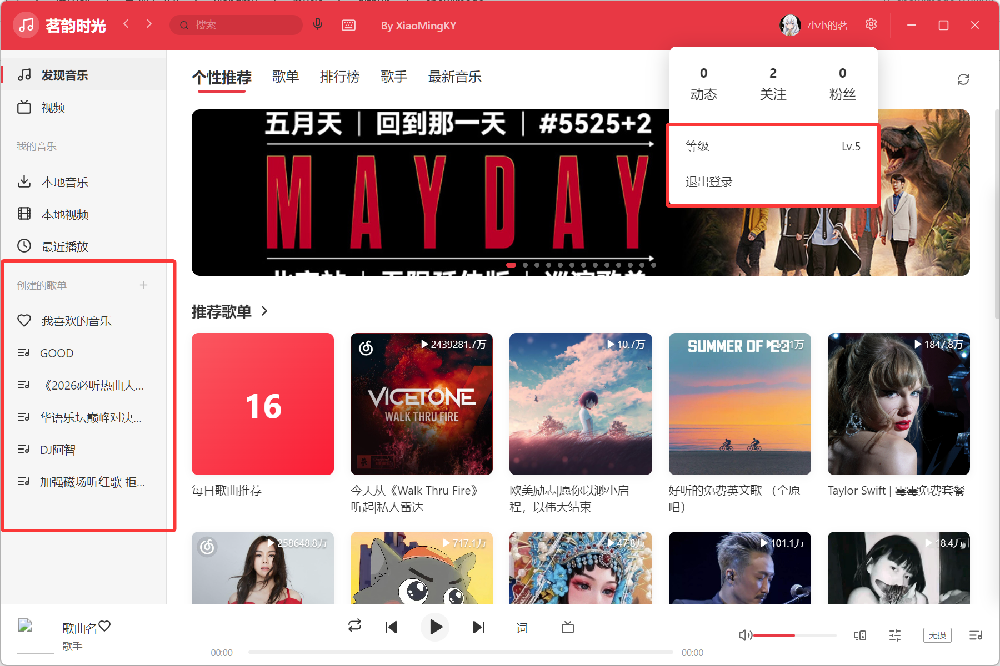
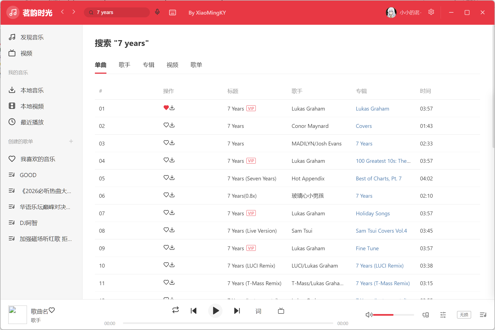
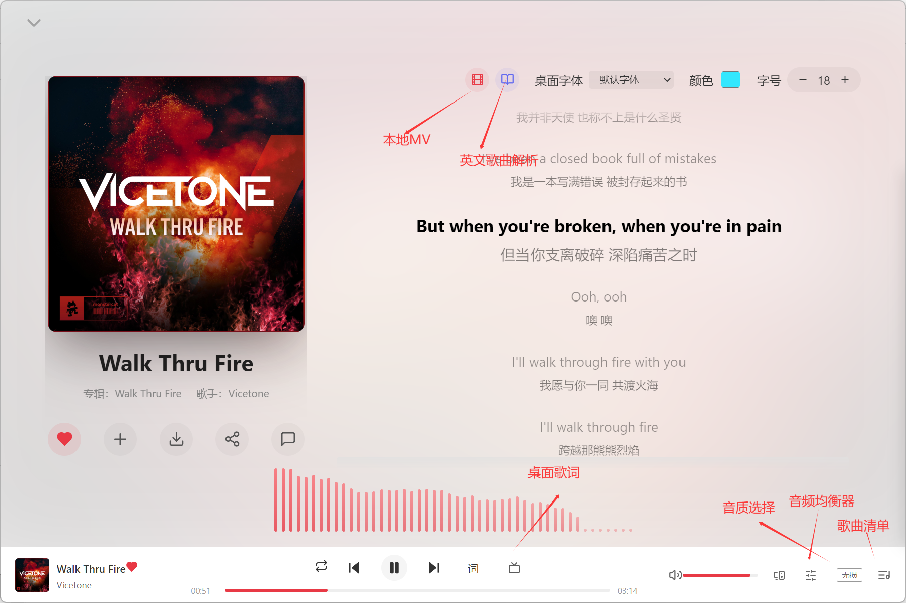
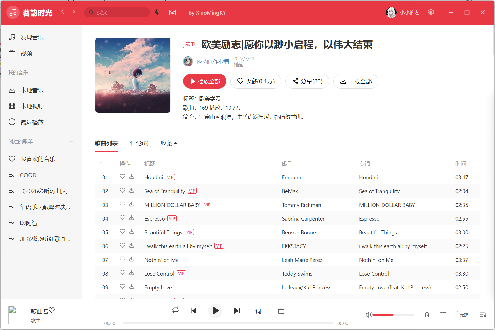
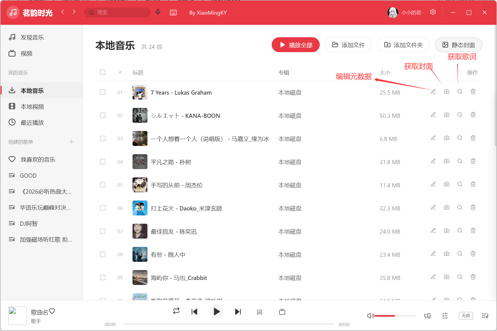
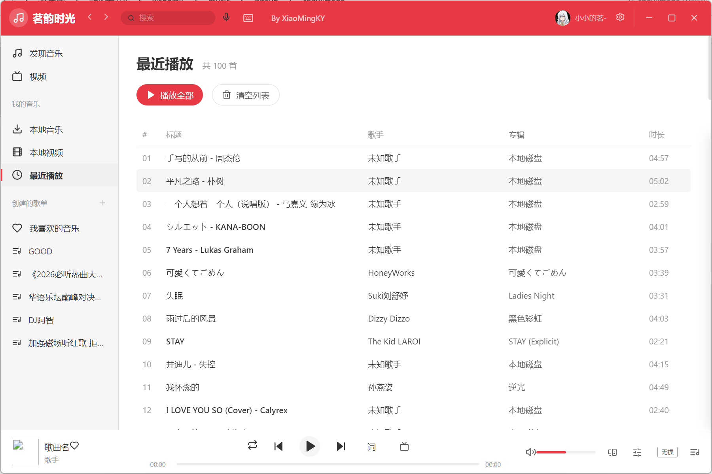
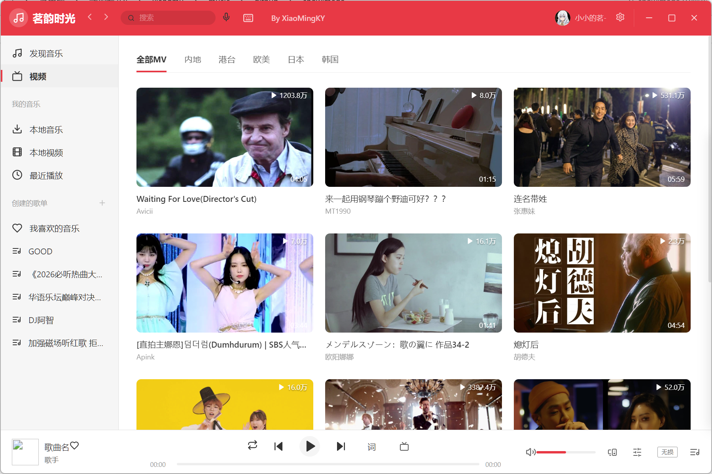
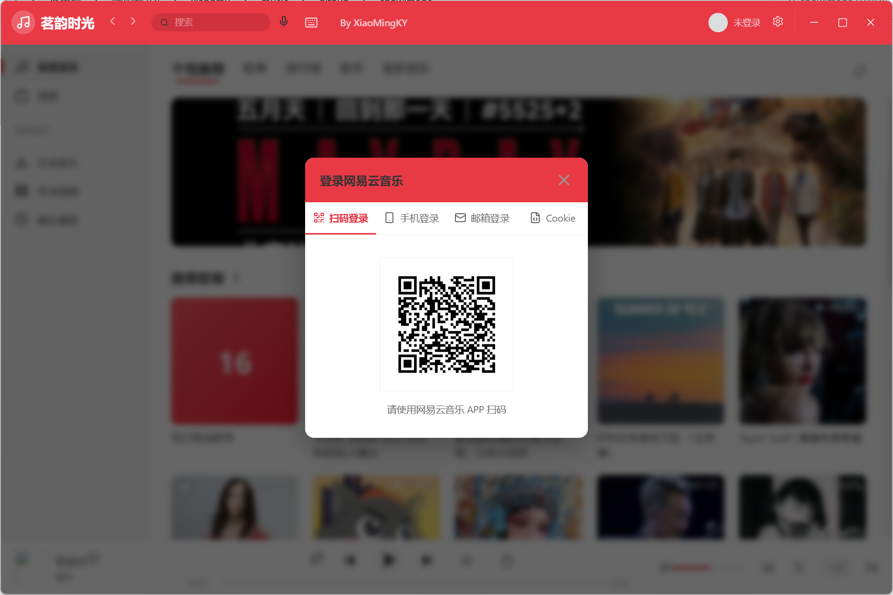

# 🎵 茗韵时光 (MingYun Time) — Music Player

> **本项目完全由 AI (Claude Code) 创作** | [English Version](README_EN.md)

一款精美的桌面音乐播放器，基于 **Vue 3** + **Electron** 构建，集成网易云音乐 API，支持在线音乐播放/搜索/歌单管理。

---

## ✨ 功能

### 🏠 发现音乐



- 个性推荐、轮播图、歌单、最新音乐、排行榜、热门歌手

### 🔍 搜索



- 搜索歌曲、歌手、专辑、视频、歌单

### 🎧 歌曲详情



- 全屏歌词覆盖层，封面展示、频谱可视化
- 收藏、添加到歌单、下载、分享、评论

### 📋 歌单管理



- 创建、删除、编辑、收藏歌单
- 添加/移除歌曲，上传自定义封面

### 💻 本地音乐



- 导入文件/文件夹（MP3、FLAC、WAV、OGG、M4A）
- **自动匹配在线封面**，保存到歌曲同目录
- **自动匹配在线歌词**（.lrc），保存到歌曲同目录
- 元数据编辑（标题、歌手、专辑、年份、风格、封面）
- GIF/静态封面切换

### 🔄 最近播放



- 播放历史记录，支持快速播放

### 🎤 桌面歌词

- 悬浮透明歌词窗口，始终置顶
- **锁定模式**：鼠标穿透到下层应用 + 独立解锁按钮
- 字体、颜色、字号可自定义

### 🎚️ 均衡器

- 8 种预设：默认、流行、古典、摇滚、电子、人声、爵士、低音
- 10 段图示均衡器，增益范围 -12dB ~ +12dB

### 📝 英文歌词解析

- 基于 DeepSeek API 的 AI 语法解析
- 逐词成分标注、时态语态句型、词汇变形详解
- 解析结果本地缓存，离线可用

### 🎬 视频 & MV



- 在线视频浏览、本地视频管理
- MV 播放器，自动匹配本地 MV 文件

### 🔐 登录



- 手机号、邮箱、二维码登录
- 用户信息同步、歌单同步

### 🖥️ 系统托盘

- 托盘最小化、托盘控制（上下曲/播放暂停）、快速退出

### 🎨 界面

- 简洁现代设计、响应式侧边栏、流畅动画、毛玻璃效果

---

## 🚀 快速开始

### 环境要求
- **Node.js** ≥ 18
- **npm** ≥ 9

### 安装
```bash
npm install
```

### 开发预览
```bash
npm run dev
```

### 构建发布
```bash
npm run build
```
构建后的安装包在 `release/` 目录下。

---

## ⚙️ 配置说明

### 1. 网易云音乐 API

本项目集成网易云音乐 API，需配置 API 服务地址。你可以：
- **自己部署**：[NeteaseCloudMusicApi](https://github.com/Binaryify/NeteaseCloudMusicApi)，部署后获得你的 API 地址
- **或使用他人分享的成品 API 地址**（直接填入即可）

打开 `src/api/index.js`，修改第 **4 行** 的 `baseURL`：

```js
// src/api/index.js  第 4 行
const request = axios.create({
    baseURL: 'https://your-netease-api-server.com',  // ← 改为你的 API 地址（自己部署的或他人成品）
    timeout: 30000,
    withCredentials: true
})
```

### 2. DeepSeek API Key（英文解析）

英文歌词解析功能需要 **DeepSeek API Key**。

获取地址：https://platform.deepseek.com

两种方式：
- 在应用界面的英文解析面板中输入（自动保存到本地）
- 或在 `src/components/EnglishAnalysis.vue` 中设置默认值

---

## 🏗️ 技术栈

| 层级 | 技术 |
|------|------|
| 前端 | Vue 3 (Composition API)、Pinia、Vue Router 5 |
| 桌面 | Electron 22 |
| 构建 | Vite 5、vite-plugin-electron、electron-builder |
| 图标 | Lucide Vue Next |
| 音频 | Web Audio API（均衡器）、HTML5 Audio |
| 元数据 | music-metadata、node-id3 |

---

## 📁 项目结构

```
music/
├── electron/            # Electron 主进程
│   └── main.js          # 窗口管理、IPC 处理、协议注册
├── src/
│   ├── api/index.js     # API 客户端 (axios)
│   ├── store/           # Pinia 状态管理 (player、user、message)
│   ├── router/          # Vue Router 路由
│   ├── views/           # 页面组件
│   │   ├── Discovery.vue      # 发现音乐
│   │   ├── Search.vue         # 搜索
│   │   ├── SongDetail.vue     # 歌曲详情/全屏歌词
│   │   ├── PlaylistDetail.vue # 歌单详情管理
│   │   ├── AlbumDetail.vue    # 专辑详情
│   │   ├── LocalMusic.vue     # 本地音乐管理
│   │   ├── LocalVideo.vue     # 本地视频管理
│   │   ├── RecentPlay.vue     # 最近播放
│   │   ├── Video.vue          # 在线视频
│   │   └── DesktopLyrics.vue  # 桌面歌词窗口
│   ├── components/      # 共享组件
│   │   ├── EnglishAnalysis.vue  # AI 英文歌词解析
│   │   ├── EqPanel.vue          # 均衡器面板
│   │   ├── LoginModal.vue       # 登录弹窗
│   │   ├── MvPlayer.vue         # MV 播放器
│   │   └── Toast.vue            # 通知提示
│   ├── style.css        # 全局样式 + CSS 变量
│   ├── App.vue          # 根组件（布局外壳）
│   └── main.js          # 应用入口
├── showimage/           # README 截图
├── font/                # 桌面歌词自定义字体
├── build/               # 构建资源（图标）
├── package.json
└── README.md
```

---

## 📦 下载

前往 [Releases](https://github.com/xiaomingky/XiaoMingKY163_Player/releases) 页面下载最新安装包。

---

## 📄 协议

MIT

---

## 👤 联系

- 网站：[xiaomingky.cn](https://xiaomingky.cn)
- 问题反馈：[GitHub Issues](https://github.com/xiaomingky/XiaoMingKY163_Player/issues)
