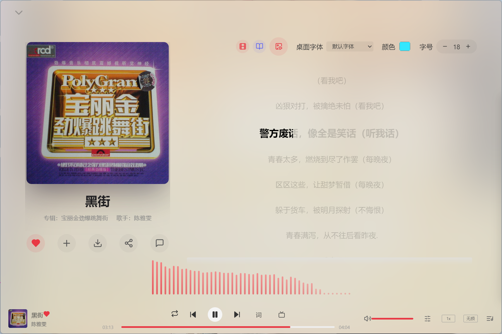
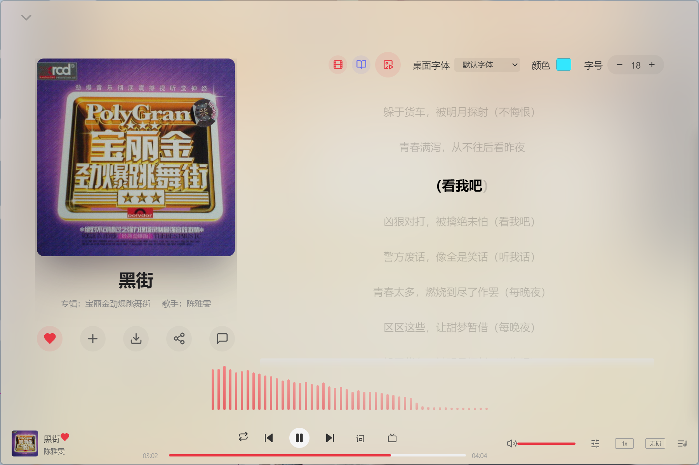
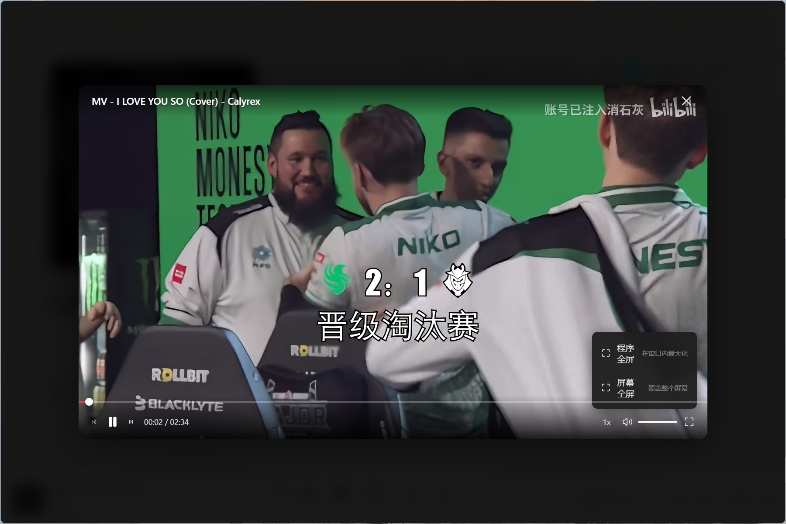
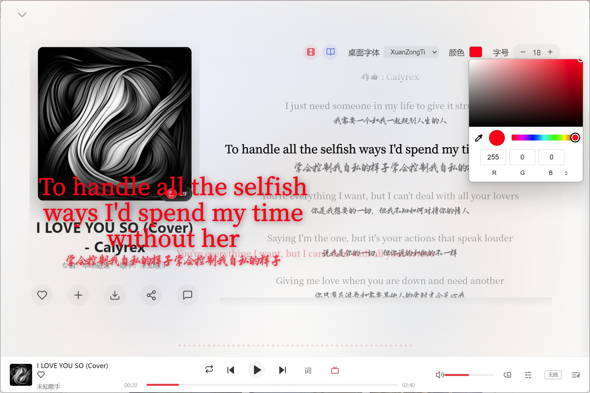
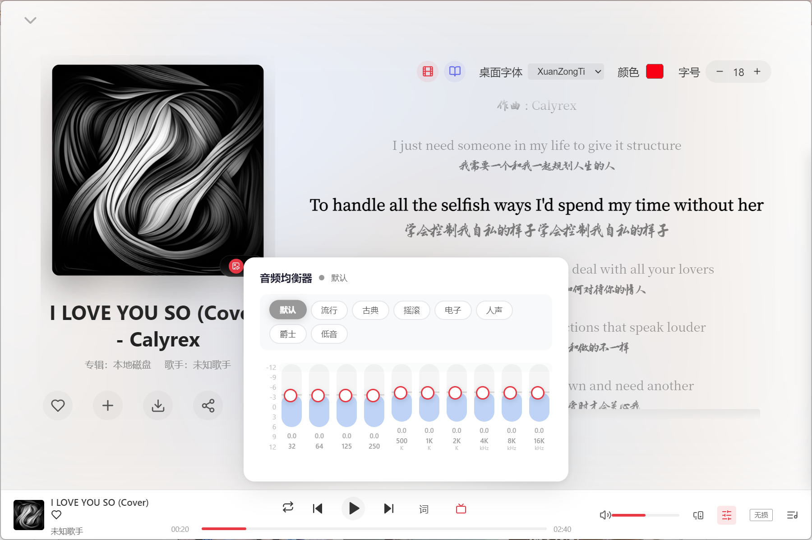
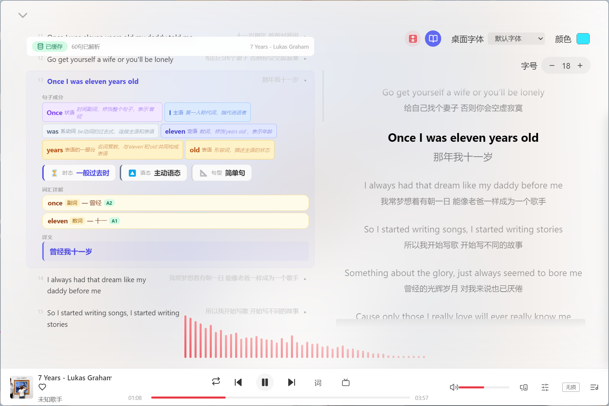

# 🎵 茗韵时光 (MingYun Time) — Music Player

> **This project is entirely created by AI (Claude Code)** | [中文版](README.md)

A beautiful, feature-rich desktop music player built with **Vue 3** + **Electron**, integrated with Netease Cloud Music API for online music playback, search, and playlist management.

---

## ✨ Features

### 🏠 Discovery


- Personalized recommendations, banners, playlists, new songs, rankings, and top artists

### 🔍 Search


- Search songs, artists, albums, videos, and playlists

### 🎧 Song Detail


- Full-screen overlay with synchronized lyrics, cover art, and visualizer
- **Immersive/Classic dual mode**: background follows cover color or pure white
- Apple Music-level word-by-word lyric highlighting (YRC)
- Like, add to playlist, download, share, comment
- Built-in font switching, customizable lyric font/color/size




### 📋 Playlists


- Create, delete, edit, and subscribe to playlists
- Add/remove tracks, upload custom cover images

### 💻 Local Music


- Import individual files or entire folders (MP3, FLAC, WAV, OGG, M4A)
- **Auto-fetch cover art** → auto-downloaded as `song.jpg` to the song's directory
- **Auto-fetch lyrics** → auto-saved as `song.lrc` to the song's directory
- Metadata editing (title, artist, album, year, genre, cover)
- GIF/static cover toggle
- **Download songs with auto-embedded cover art**


- Local MV matching and playback



### 🔄 Recent Play


- Track listening history with quick play support

### 🎤 Desktop Lyrics



- Floating transparent lyrics window, always on top
- **60FPS word-by-word highlight**: GPU-accelerated, buttery smooth
- **Lock mode**: click-through to apps underneath + independent unlock button
- Customizable font, color, and size

### 🎚️ Equalizer



- 8 built-in presets: Default, Pop, Classical, Rock, Electronic, Vocal, Jazz, Bass
- 10-band graphic EQ with adjustable gain (-12dB ~ +12dB)

### 📝 English Lyrics Analysis



- AI-powered grammar analysis using DeepSeek API
- Word-by-word parsing · tense · voice · sentence structure · vocabulary with word forms
- Results auto-saved as `song.analysis.json` to the song's directory (offline capable)

### 🎬 Video & MV


- Online video browsing, local video management
- MV player with local MV matching

### 🔐 Login


- Phone, email, and QR code login
- User profile and playlists sync

### 🖥️ System Tray

- Minimize to tray, tray controls (prev/play/next), quick exit

### 🎨 UI

- Clean modern design, responsive sidebar, smooth transitions
- Custom scrollbar, glassmorphism effects

---

## 🚀 Quick Start

### Prerequisites
- **Node.js** ≥ 18
- **npm** ≥ 9

### Install
```bash
npm install
```

### Development
```bash
npm run dev
```

### Build
```bash
npm run build
```
The built installer will be in the `release/` folder.

---

## ⚙️ Configuration

### 1. Netease Cloud Music API

This project integrates the Netease Cloud Music API. You need to configure an API server URL. Either:
- **Self-host**: Deploy [NeteaseCloudMusicApi](https://github.com/Binaryify/NeteaseCloudMusicApi) and get your API URL
- **Or use a shared API URL** from someone else (just paste it in)

Open `src/api/index.js` and change the `baseURL` at **line 4**:

```js
// src/api/index.js  line 4
const request = axios.create({
    baseURL: 'https://your-netease-api-server.com',  // ← Your API URL (self-hosted or shared)
    timeout: 30000,
    withCredentials: true
})
```

### 2. AI Model API Key (English Lyrics Analysis)

The English lyrics analysis supports two AI models:

| Model | Get Key | Note |
|-------|---------|------|
| DeepSeek | https://platform.deepseek.com | Default |
| MiMo v2.5-pro | https://api.xiaomimimo.com | New, faster |

**How to configure:**
1. Launch the app and go to "Local Music"
2. In the English analysis panel, select a model
3. Enter the corresponding API Key (saved automatically)


---

## 🏗️ Tech Stack

| Layer | Technology |
|------|-----------|
| Frontend | Vue 3 (Composition API), Pinia, Vue Router 5 |
| Desktop | Electron 22 |
| Build | Vite 5, vite-plugin-electron, electron-builder |
| Icons | Lucide Vue Next |
| Audio | Web Audio API (EQ), HTML5 Audio |
| Metadata | music-metadata, node-id3 |

---

## 📁 Project Structure

```
music/
├── electron/            # Electron main process
│   └── main.js          # Window management, IPC handlers, protocols
├── src/
│   ├── api/index.js     # API client (axios)
│   ├── store/           # Pinia stores (player, user, message)
│   ├── router/          # Vue Router
│   ├── views/           # Page components
│   │   ├── Discovery.vue      # Home / discovery
│   │   ├── Search.vue         # Search
│   │   ├── SongDetail.vue     # Full-screen lyrics overlay
│   │   ├── PlaylistDetail.vue # Playlist detail + management
│   │   ├── AlbumDetail.vue    # Album detail
│   │   ├── LocalMusic.vue     # Local music management
│   │   ├── LocalVideo.vue     # Local video management
│   │   ├── RecentPlay.vue     # Recent play history
│   │   ├── Video.vue          # Online videos
│   │   └── DesktopLyrics.vue  # Desktop lyrics window
│   ├── components/      # Shared components
│   │   ├── EnglishAnalysis.vue  # AI English lyrics analysis
│   │   ├── EqPanel.vue          # Equalizer panel
│   │   ├── LoginModal.vue       # Login modal
│   │   ├── MvPlayer.vue         # MV player
│   │   └── Toast.vue            # Toast notifications
│   ├── style.css        # Global styles + CSS variables
│   ├── App.vue          # Root component (layout shell)
│   └── main.js          # App entry
├── showimage/           # Screenshots
├── font/                # Custom fonts for desktop lyrics
├── build/               # Build resources (icons)
├── package.json
└── README.md
```

---

## 📦 Download

Go to the [Releases](https://github.com/xiaomingky/MingYunTime/releases) page to download the latest installer.

---

## ☕ Support

If you like this app, buy the developer a coffee!


---

## 📄 License

MIT

---

## 👤 Contact

- Website: [xiaomingky.cn](https://xiaomingky.cn)
- Issues: [GitHub Issues](https://github.com/xiaomingky/MingYunTime/issues)
